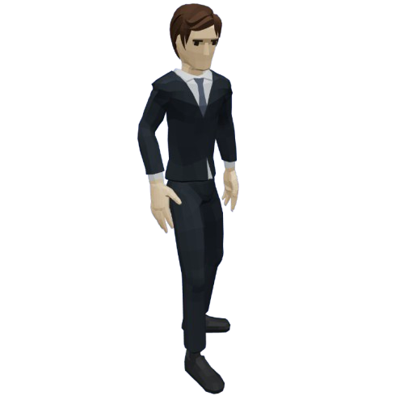
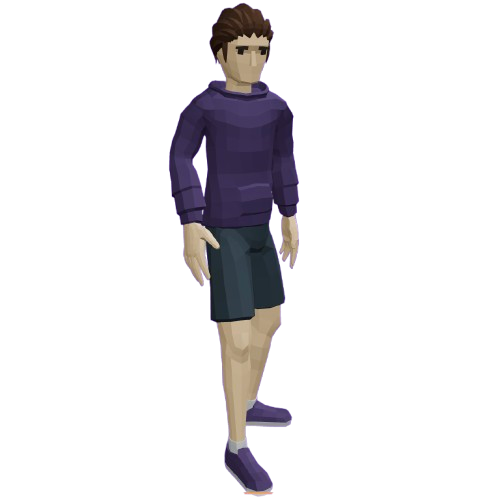
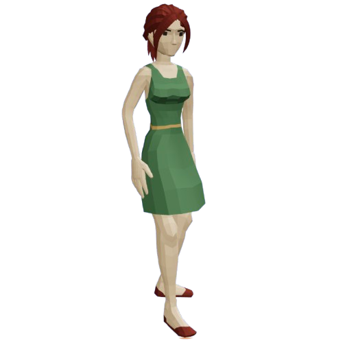
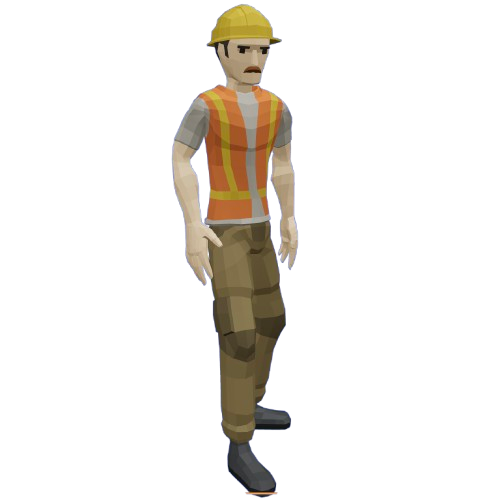

<!-- See: Docs/Specifications/FuncSpecs-Helper.md -->

# Functional Specifications

---

**Title:** Bring Back the City ***(Name TBD)***

**Team:** Team 5

**Author:** Pierre GORIN

**Reviewer:** Maxime CARON

**Created on:** November 6th, 2024

**Last updated:** November 17th, 2024

**Version:** 0.0.5

---

### Approvals

| Reviewer          | Role              | Approved | Date |
| ----------------- | ----------------- | -------- | ---- |
| Maxime CARON      | Quality Assurance |          |      |
| Rémy CHARLES      | Project Manager   |          |      |
| Pierre GORIN      | Program Manager   |          |      |
| Salaheddine NAMIR | Technical Lead    |          |      |
| Elone DELILLE     | Technical Writer  |          |      |
| Alexis LASSELIN   | Software Engineer |          |      |
| Camille GAYAT     | Software Engineer |          |      |

 

<h2 id="toc"> Table of Contents <i>(Click to expand)</i></h2>

- [Functional Specifications](#functional-specifications)
    - [Approvals](#approvals)
- [1. - Introduction](#1---introduction)
  - [1.1 - Overview](#11---overview)
      - [What is a Serious Game?](#what-is-a-serious-game)
      - [What is Climate Change?](#what-is-climate-change)
      - [What is Carbon Footprint?](#what-is-carbon-footprint)
  - [1.2 - Project Definition](#12---project-definition)
    - [1.2.1 - Purpose](#121---purpose)
    - [1.2.2 - Scope](#122---scope)
    - [1.2.3 - Deliverables](#123---deliverables)
  - [1.3 - Project Organization](#13---project-organization)
    - [1.3.1 - Project Representatives](#131---project-representatives)
    - [1.3.2 - Stakeholders](#132---stakeholders)
    - [1.3.3 - Project Team](#133---project-team)
    - [1.3.4 - Project Reviewers](#134---project-reviewers)
- [2. - Game Overview](#2---game-overview)
  - [2.1 - Game Concept](#21---game-concept)
    - [2.1.1 - Game Genre](#211---game-genre)
    - [2.1.2 - Game Audience](#212---game-audience)
      - [2.1.2.1 - Rating](#2121---rating)
      - [2.1.2.2 - Audience](#2122---audience)
    - [2.1.3 - Game Setting](#213---game-setting)
    - [2.1.4 - Game Mechanics](#214---game-mechanics)
    - [2.1.5 - Synopsis](#215---synopsis)
  - [2.2 - Game Objectives](#22---game-objectives)
    - [2.2.1 - Game Goals](#221---game-goals)
    - [2.2.2 - Game Challenges](#222---game-challenges)
  - [2.3 - Game Features](#23---game-features)
    - [2.3.1 - Resource Balancing](#231---resource-balancing)
    - [2.3.2 - Game Dilemmas](#232---game-dilemmas)
    - [2.3.3 - Characters](#233---characters)

# 1. - Introduction

## 1.1 - Overview

The aim of this project is to create a **Serious Game** about **Climate Change**, more focused on **Carbon Footprint**. The game will be designed to raise awareness about climate change and its consequences. 

#### What is a Serious Game?
A **Serious Game** is a game designed for a primary purpose other than pure entertainment. The "serious" adjective is generally prepended to refer to video games used by industries like defense, education, scientific exploration, health care, emergency management, city planning, engineering, religion, and politics.

#### What is Climate Change?
**Climate Change** is a long-term change in the average weather patterns that have come to define Earth's local, regional, and global climates. It is caused by the increase of greenhouse gases in the atmosphere, which trap heat. This leads to a rise in the Earth's temperature, which causes the melting of ice caps, the rise of sea levels, and the increase of extreme weather events.

#### What is Carbon Footprint?
A **Carbon Footprint** is the total amount of greenhouse gases (including carbon dioxide and methane) that are generated by our actions. It is usually expressed in equivalent tons of carbon dioxide (CO₂). The carbon footprint is a measure of the impact human activities have on the environment in terms of the amount of greenhouse gases produced.

## 1.2 - Project Definition

### 1.2.1 - Purpose

[_(Back to top)_](#toc)

Our game combines city management mechanics with an educational focus on environmental issues. The player must make decisions to lower their city's carbon footprint while maintaining a balance of four critical resources:

1. CO₂ Levels – The environmental impact of the city.
2. Money – The city’s financial resources.
3. Population – The number of citizens in the city.
4. Happiness – The overall satisfaction of the population.

If the Happiness resource reaches zero, the player is deemed to have failed as mayor, resulting in a Game Over.

### 1.2.2 - Scope

[_(Back to top)_](#toc)

Below is a MoSCoW table that lists the features that are in scope and out of scope for this project.

| Feature                    | Description                                                                     | Must Have | Should Have | Could Have | Won't Have |
| -------------------------- | ------------------------------------------------------------------------------- | --------- | ----------- | ---------- | ---------- |
| City Management            | The player will manage a city and its resources.                                | 🟢         |             |            |            |
| Decision-Making System     | The player will make impactful decisions with long-term consequences.           | 🟢         |             |            |            |
| Resource Balancing         | The player must balance CO₂, money, population, and happiness.                  | 🟢         |             |            |            |
| Dilemmas with Explanations | The game will present educational dilemmas related to environmental challenges. | 🟢         |             |            |            |
| 2D Isometric View          | The game will feature a 2D isometric visual style.                              | 🟢         |             |            |            |
| Tutorial                   | The player will have a tutorial explaining the mechanics.                       |           | 🟡           |            |            |
| Save Game                  | The player can save their progress.                                             |           | 🟡           |            |            |
| Music                      | The game will include background music.                                         |           | 🟡           |            |            |
| Sound Effects              | The game will include sound effects for feedback.                               |           | 🟡           |            |            |
| Multiplayer                | The player can play with others.                                                |           |             |            | 🔴          |

### 1.2.3 - Deliverables

[_(Back to top)_](#toc)

The deliverables of this project are:

| Deliverable               | Due Date   | Link to the Document                                       |
| ------------------------- | ---------- | ---------------------------------------------------------- |
| Functional Specifications | 11/22/2024 | [🔗 Functional Specifications](FunctionalSpecifications.md) |
| Technical Specifications  | 11/29/2024 | [🔗 Technical Specifications](https://guthib.com/)          |
| Test Plan                 | 12/06/2024 | [🔗 Test Plan](https://guthib.com/)                         |
| User Manual               | 12/13/2024 | [🔗 User Manual](https://guthib.com/)                       |
| Code                      | 12/13/2024 | [🔗 Code](https://guthib.com/)                              |

## 1.3 - Project Organization

### 1.3.1 - Project Representatives

[_(Back to top)_](#toc)

| Owners                                                                                  | Representative                                                                                       |
| --------------------------------------------------------------------------------------- | ---------------------------------------------------------------------------------------------------- |
| [ALGOSUP](https://www.algosup.com)                                                      | Represented by [Franck JEANNIN](https://www.linkedin.com/in/franck-jeannin/)                         |
| [Konstantinos DIMOPOULOS](https://www.linkedin.com/in/konstantinos-dimopoulos-42b62b4/) | Represented by himself                                                                               |
| [Rémy Charles](https://www.linkedin.com/in/r%C3%A9my-charles-2a8960232/)                | Represented by [Pierre GORIN](https://www.linkedin.com/in/pierre-gorin-61a784221/) (Program Manager) |

### 1.3.2 - Stakeholders

[_(Back to top)_](#toc)

| Stakeholder             | Description                                           |
| ----------------------- | ----------------------------------------------------- |
| ALGOSUP                 | They are the owners of the project.                   |
| Konstantinos D.         | He is the consultant for the game design.             |
| Team 5                  | They are the developers of the project.               |
| 3D Molier International | Partners for the 3D model of the secondary character. |
| End-Users               | They are the players of the game.                     |
| Reviewers               | They are the external reviewers of the project.       |

### 1.3.3 - Project Team

[_(Back to top)_](#toc)

| Role              | Description                                                                                                                                                                                                                    | Name                                                                                                     |
| ----------------- | ------------------------------------------------------------------------------------------------------------------------------------------------------------------------------------------------------------------------------ | -------------------------------------------------------------------------------------------------------- |
| Project Manager   | - He is in charge of organization, planning, and budgeting. - Ensure communication within the team and keep them motivated.                                                                                                 | [Rémy CHARLES](https://github.com/RemyCHARLES)                                                           |
| Program Manager   | - Makes sure the project meets the client's expectations. - He must to understand the end-user needs. - He is responsible for writing the Functional Specifications.                                                     | [Pierre GORIN](https://github.com/Pierre2103)                                                            |
| Technical Lead    | - He is in charge of making the technical decisions in the project. - He translates the Functional Specifications into Technical Specifications.                                                                            | [Salaheddine NAMIR](https://github.com/T3rryc)                                                           |
| Technical Writer  | - He is in charge of writing the documentation of the project. - Based on the specifications, he writes a Manual for the end-users.                                                                                         | [Elone DELILLE](https://github.com/HiNett)                                                               |
| Software Engineer | - Responsible for writing the code and the unit tests, commenting, and documenting his code. - He participates in the technical choices.                                                                                    | [Alexis LASSELIN](https://github.com/AlexisLasselin) [Camille GAYAT](https://github.com/CamilleGayat) |
| Quality Assurance | - Tests all the functionalities of the product to find bugs and issues. Defines the test strategy and writes the Test Plan. - He documents all the encountered bugs and issues, then checks that the errors are well fixed. | [Maxime CARON](https://github.com/MaximeAlgosup)                                                         |

### 1.3.4 - Project Reviewers

Our quality assurance will review the project to ensure that the specifications and conventions are respected.
External project reviewers have been appointed by the project owner to review our specifications and provide us with feedback.

# 2. - Game Overview

## 2.1 - Game Concept

### 2.1.1 - Game Genre

The game will be a **Serious Game** with elements of **Strategy** and **City Management**. The focus is on resource balancing and decision-making to raise awareness about environmental issues. Players will encounter ecological dilemmas, requiring strategic thinking and moral consideration.

### 2.1.2 - Game Audience

#### 2.1.2.1 - Rating

The game will carry a **T (Teen 13+) rating** in the United States and a **PEGI 12 rating** in Europe.

 A **T (Teen 13+) rating** allows content suitable for players aged 13 and up, which may include violence, suggestive themes, crude humor, minimal blood, simulated gambling, and occasional strong language.

 A **PEGI 12 rating** permits fantasy violence, non-realistic violence toward human-like characters, and mild nudity with some graphic detail.

In our case, the game will be mild, containing no violence or nudity. We chose this rating to allow for occasional strong language to enhance character expression and realism, while still remaining accessible to a younger audience.

#### 2.1.2.2 - Audience

The primary audience includes teenagers and young adults interested in environmental topics and strategy games. The game's mechanics and dilemmas are designed to appeal to players seeking a mix of learning and strategic challenges.

### 2.1.3 - Game Setting

The game will be available on computers, the supported operating systems will be Windows  and MacOS . 
The player will be able to set the language of the game in the settings, the game will be available in American English  and French .

### 2.1.4 - Game Mechanics  

1. **Resource Management**: Players must manage key resources (CO₂, money, population, and happiness) to maintain balance in the city.
2. **Dilemmas**: Players face ecological dilemmas (e.g., renovate vs. demolish and rebuild) with simplified, educational explanations.
3. **Strategic Decision-Making**: The choices players make will directly affect resources and overall outcomes.
4. **Game Over Condition**: If CO₂ levels rise too high or the population is insufficiently happy, the player loses the game.

### 2.1.5 - Synopsis

Players step into the shoes of a city mayor tasked with reducing their city’s carbon footprint while balancing financial resources, population growth, and citizen happiness. Through strategic decisions and engaging dilemmas, players learn about the impact of urban planning and resource management on the environment.

## 2.2 - Game Objectives

### 2.2.1 - Game Goals

1. **Raise Awareness**: Teach players about the importance of sustainable practices through gameplay.
2. **Encourage Reflection**: Highlight the environmental consequences of urban decisions.
3. **Empower Decisions**: Show how thoughtful choices can lead to positive environmental outcomes.

### 2.2.2 - Game Challenges

1. **Resource Management**: Players must manage CO₂ emissions, financial budgets, population needs, and happiness levels effectively.
2. **Ecological Dilemmas**: Players face moral and strategic decisions, each with pros and cons.
3. **Difficulty Scaling**: The game becomes progressively more complex as players advance.

## 2.3 - Game Features

### 2.3.1 - Resource Balancing

The game will track four core resources:
- **CO₂ Levels**: Represents environmental impact.
- **Money**: Tracks city finances.
- **Population**: Indicates city growth.
- **Happiness**: Reflects citizen satisfaction and serves as a failure condition.

### 2.3.2 - Game Dilemmas

Each in-game decision presents a dilemma with educational context, such as:  
- **Renovate vs. Rebuild**: Renovating a building saves resources but may not be as efficient. Rebuilding costs more but could have a lower long-term carbon footprint.

### 2.3.3 - Characters

| Name             | Description                                            | Role                 | Image                                                                  |
| ---------------- | ------------------------------------------------------ | -------------------- | ---------------------------------------------------------------------- |
| Mayor            | The player character, acting as the mayor of the city. | Protagonist          |             |
| Citizen          | Represents the city's population and happiness.        | Supporting Character |           |
| Environmentalist | Provides advice and context on ecological dilemmas.    | Supporting Character |  |
| Worker           | Represents the city's labor force.                     | Supporting Character |            |