<!-- See: Docs/Specifications/FuncSpecs-Helper.md -->

# Functional Specifications

---

**Title:** Carbon Control

**Team:** Team 5

**Author:** Pierre GORIN

**Reviewer:** Maxime CARON

**Created on:** November 6th, 2024

**Last updated:** November 17th, 2024

**Version:** 0.0.5

---

### Approvals

| Reviewer          | Role              | Approved | Date |
| ----------------- | ----------------- | -------- | ---- |
| Maxime CARON      | Quality Assurance |          |      |
| Rémy CHARLES      | Project Manager   |          |      |
| Pierre GORIN      | Program Manager   |          |      |
| Salaheddine NAMIR | Technical Lead    |          |      |
| Elone DELILLE     | Technical Writer  |          |      |
| Alexis LASSELIN   | Software Engineer |          |      |
| Camille GAYAT     | Software Engineer |          |      |

 

<h2 id="toc"> Table of Contents <i>(Click to expand)</i></h2>

- [Functional Specifications](#functional-specifications)
    - [Approvals](#approvals)
- [1. - Introduction](#1---introduction)
  - [1.1 - Overview](#11---overview)
      - [What is a Serious Game?](#what-is-a-serious-game)
      - [What is Climate Change?](#what-is-climate-change)
      - [What is Carbon Footprint?](#what-is-carbon-footprint)
  - [1.2 - Project Definition](#12---project-definition)
    - [1.2.1 - Purpose](#121---purpose)
    - [1.2.2 - Scope](#122---scope)
    - [1.2.3 - Deliverables](#123---deliverables)
  - [1.3 - Project Organization](#13---project-organization)
    - [1.3.1 - Project Representatives](#131---project-representatives)
    - [1.3.2 - Stakeholders](#132---stakeholders)
    - [1.3.3 - Project Team](#133---project-team)
    - [1.3.4 - Project Reviewers](#134---project-reviewers)
- [2. - Game Overview](#2---game-overview)
  - [2.1 - Game Concept](#21---game-concept)
    - [2.1.1 - Game Genre](#211---game-genre)
    - [2.1.2 - Game Audience](#212---game-audience)
      - [2.1.2.1 - Rating](#2121---rating)
      - [2.1.2.2 - Audience](#2122---audience)
    - [2.1.3 - Game Setting](#213---game-setting)
    - [2.1.4 - Game Mechanics](#214---game-mechanics)
    - [2.1.5 - Synopsis](#215---synopsis)
    - [2.1.6 - Visual Style](#216---visual-style)
    - [2.1.7 - Game Controls](#217---game-controls)
    - [2.2.1 - Game Goals](#221---game-goals)
    - [2.2.2 - Game Challenges](#222---game-challenges)
  - [2.3 - Game Features](#23---game-features)
    - [2.3.1 - Resource Balancing](#231---resource-balancing)
    - [2.3.2 - Game Dilemmas](#232---game-dilemmas)
    - [2.3.3 - Characters](#233---characters)
    - [2.3.4 - Game Level](#234---game-level)
    - [2.3.5 - Construction Grid](#235---construction-grid)
- [3. - Assets and Resources](#3---assets-and-resources)
  - [3.1 - Game Assets](#31---game-assets)
    - [3.1.1 - Buildings](#311---buildings)
      - [3.1.1.1 - Residential Buildings](#3111---residential-buildings)
      - [3.1.1.2 - Commercial Buildings](#3112---commercial-buildings)
      - [3.1.1.2 - Industrial Buildings](#3112---industrial-buildings)
      - [3.1.1.3 - Public Buildings](#3113---public-buildings)
    - [3.1.2 - Green Spaces and Energy Sources](#312---green-spaces-and-energy-sources)
    - [3.1.3 - Decorative Elements](#313---decorative-elements)
    - [3.1.4 - Ground Textures](#314---ground-textures)
    - [3.1.5 - Vehicles](#315---vehicles)
    - [3.1.6 - Icons](#316---icons)
    - [3.1.7 - Sound Effects](#317---sound-effects)
    - [3.1.8 - Music](#318---music)
    - [3.1.9 - Fonts](#319---fonts)
      - [3.1.9.1 - Main Font](#3191---main-font)
      - [3.1.9.2 - Secondary Font](#3192---secondary-font)

# 1. - Introduction

## 1.1 - Overview

The aim of this project is to create a **Serious Game** about **Climate Change**, more focused on **Carbon Footprint**. The game will be designed to raise awareness about climate change and its consequences. 

#### What is a Serious Game?
A **Serious Game** is a game designed for a primary purpose other than pure entertainment. The "serious" adjective is generally prepended to refer to video games used by industries like defense, education, scientific exploration, health care, emergency management, city planning, engineering, religion, and politics.

#### What is Climate Change?
**Climate Change** is a long-term change in the average weather patterns that have come to define Earth's local, regional, and global climates. It is caused by the increase of greenhouse gases in the atmosphere, which trap heat. This leads to a rise in the Earth's temperature, which causes the melting of ice caps, the rise of sea levels, and the increase of extreme weather events.

#### What is Carbon Footprint?
A **Carbon Footprint** is the total amount of greenhouse gases (including carbon dioxide and methane) that are generated by our actions. It is usually expressed in equivalent tons of carbon dioxide (CO₂). The carbon footprint is a measure of the impact human activities have on the environment in terms of the amount of greenhouse gases produced.

## 1.2 - Project Definition

### 1.2.1 - Purpose

[_(Back to top)_](#toc)

Our game combines city management mechanics with an educational focus on environmental issues. The player must make decisions to lower their city's carbon footprint while maintaining a balance of four critical resources:

1. CO₂ Levels – The environmental impact of the city.
2. Money – The city’s financial resources.
3. Population – The number of citizens in the city.
4. Happiness – The overall satisfaction of the population.

If the Happiness resource reaches zero, the player is deemed to have failed as mayor, resulting in a Game Over.

### 1.2.2 - Scope

[_(Back to top)_](#toc)

Below is a MoSCoW table that lists the features that are in scope and out of scope for this project.

| Feature                    | Description                                                                     | Must Have | Should Have | Could Have | Won't Have |
| -------------------------- | ------------------------------------------------------------------------------- | --------- | ----------- | ---------- | ---------- |
| City Management            | The player will manage a city and its resources.                                | 🟢         |             |            |            |
| Decision-Making System     | The player will make impactful decisions with long-term consequences.           | 🟢         |             |            |            |
| Resource Balancing         | The player must balance CO₂, money, population, and happiness.                  | 🟢         |             |            |            |
| Dilemmas with Explanations | The game will present educational dilemmas related to environmental challenges. | 🟢         |             |            |            |
| 2D Isometric View          | The game will feature a 2D isometric visual style.                              | 🟢         |             |            |            |
| Tutorial                   | The player will have a tutorial explaining the mechanics.                       |           | 🟡           |            |            |
| Save Game                  | The player can save their progress.                                             |           | 🟡           |            |            |
| Music                      | The game will include background music.                                         |           | 🟡           |            |            |
| Sound Effects              | The game will include sound effects for feedback.                               |           | 🟡           |            |            |
| Multiplayer                | The player can play with others.                                                |           |             |            | 🔴          |

### 1.2.3 - Deliverables

[_(Back to top)_](#toc)

The deliverables of this project are:

| Deliverable               | Due Date   | Link to the Document                                       |
| ------------------------- | ---------- | ---------------------------------------------------------- |
| Functional Specifications | 11/22/2024 | [🔗 Functional Specifications](FunctionalSpecifications.md) |
| Technical Specifications  | 11/29/2024 | [🔗 Technical Specifications](https://guthib.com/)          |
| Test Plan                 | 12/06/2024 | [🔗 Test Plan](https://guthib.com/)                         |
| User Manual               | 12/13/2024 | [🔗 User Manual](https://guthib.com/)                       |
| Code                      | 12/13/2024 | [🔗 Code](https://guthib.com/)                              |

## 1.3 - Project Organization

### 1.3.1 - Project Representatives

[_(Back to top)_](#toc)

| Owners                                                                                  | Representative                                                                                       |
| --------------------------------------------------------------------------------------- | ---------------------------------------------------------------------------------------------------- |
| [ALGOSUP](https://www.algosup.com)                                                      | Represented by [Franck JEANNIN](https://www.linkedin.com/in/franck-jeannin/)                         |
| [Konstantinos DIMOPOULOS](https://www.linkedin.com/in/konstantinos-dimopoulos-42b62b4/) | Represented by himself                                                                               |
| [Rémy Charles](https://www.linkedin.com/in/r%C3%A9my-charles-2a8960232/)                | Represented by [Pierre GORIN](https://www.linkedin.com/in/pierre-gorin-61a784221/) (Program Manager) |

### 1.3.2 - Stakeholders

[_(Back to top)_](#toc)

| Stakeholder             | Description                                           |
| ----------------------- | ----------------------------------------------------- |
| ALGOSUP                 | They are the owners of the project.                   |
| Konstantinos D.         | He is the consultant for the game design.             |
| Team 5                  | They are the developers of the project.               |
| 3D Molier International | Partners for the 3D model of the secondary character. |
| End-Users               | They are the players of the game.                     |
| Reviewers               | They are the external reviewers of the project.       |

### 1.3.3 - Project Team

[_(Back to top)_](#toc)

| Role              | Description                                                                                                                                                                                                                    | Name                                                                                                     |
| ----------------- | ------------------------------------------------------------------------------------------------------------------------------------------------------------------------------------------------------------------------------ | -------------------------------------------------------------------------------------------------------- |
| Project Manager   | - He is in charge of organization, planning, and budgeting. - Ensure communication within the team and keep them motivated.                                                                                                 | [Rémy CHARLES](https://github.com/RemyCHARLES)                                                           |
| Program Manager   | - Makes sure the project meets the client's expectations. - He must to understand the end-user needs. - He is responsible for writing the Functional Specifications.                                                     | [Pierre GORIN](https://github.com/Pierre2103)                                                            |
| Technical Lead    | - He is in charge of making the technical decisions in the project. - He translates the Functional Specifications into Technical Specifications.                                                                            | [Salaheddine NAMIR](https://github.com/T3rryc)                                                           |
| Technical Writer  | - He is in charge of writing the documentation of the project. - Based on the specifications, he writes a Manual for the end-users.                                                                                         | [Elone DELILLE](https://github.com/HiNett)                                                               |
| Software Engineer | - Responsible for writing the code and the unit tests, commenting, and documenting his code. - He participates in the technical choices.                                                                                    | [Alexis LASSELIN](https://github.com/AlexisLasselin) [Camille GAYAT](https://github.com/CamilleGayat) |
| Quality Assurance | - Tests all the functionalities of the product to find bugs and issues. Defines the test strategy and writes the Test Plan. - He documents all the encountered bugs and issues, then checks that the errors are well fixed. | [Maxime CARON](https://github.com/MaximeAlgosup)                                                         |

### 1.3.4 - Project Reviewers

Our quality assurance will review the project to ensure that the specifications and conventions are respected.
External project reviewers have been appointed by the project owner to review our specifications and provide us with feedback.

# 2. - Game Overview

## 2.1 - Game Concept

### 2.1.1 - Game Genre

The game will be a **Serious Game** with elements of **Strategy** and **City Management**. The focus is on resource balancing and decision-making to raise awareness about environmental issues. Players will encounter ecological dilemmas, requiring strategic thinking and moral consideration.

### 2.1.2 - Game Audience

#### 2.1.2.1 - Rating

The game will carry a **T (Teen 13+) rating** in the United States and a **PEGI 12 rating** in Europe.

 A **T (Teen 13+) rating** allows content suitable for players aged 13 and up, which may include violence, suggestive themes, crude humor, minimal blood, simulated gambling, and occasional strong language.

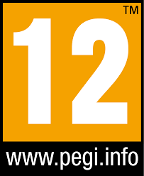 A **PEGI 12 rating** permits fantasy violence, non-realistic violence toward human-like characters, and mild nudity with some graphic detail.

In our case, the game will be mild, containing no violence or nudity. We chose this rating to allow for occasional strong language to enhance character expression and realism, while still remaining accessible to a younger audience.

#### 2.1.2.2 - Audience

The primary audience includes teenagers and young adults interested in environmental topics and strategy games. The game's mechanics and dilemmas are designed to appeal to players seeking a mix of learning and strategic challenges.

### 2.1.3 - Game Setting

The game will be available on computers, the supported operating systems will be Windows  and MacOS . 
The player will be able to set the language of the game in the settings, the game will be available in American English  and French .

### 2.1.4 - Game Mechanics  

1. **Resource Management**: Players must manage key resources (CO₂, money, population, and happiness) to maintain balance in the city.
2. **Dilemmas**: Players face ecological dilemmas (e.g., renovate vs. demolish and rebuild) with simplified, educational explanations.
3. **Strategic Decision-Making**: The choices players make will directly affect resources and overall outcomes.
4. **Game Over Condition**: If CO₂ levels rise too high or the population is insufficiently happy, the player loses the game.

### 2.1.5 - Synopsis

Players step into the shoes of a city mayor tasked with reducing their city’s carbon footprint while balancing financial resources, population growth, and citizen happiness. Through strategic decisions and engaging dilemmas, players learn about the impact of urban planning and resource management on the environment.

### 2.1.6 - Visual Style

The game will feature a **2D isometric visual style** with **low-poly assets**. All the assets are open-source and available on the internet. 

### 2.1.7 - Game Controls

The Player will be able to control the game using the keyboard (WASD keys) and the mouse. The player will be able to zoom in and out using the mouse wheel. The player will be able to access the game menu by pressing the `ESC` key.

- W - Move Camera Up
- A - Move Camera Left
- S - Move Camera Down
- D - Move Camera Right
- Mouse Wheel - Zoom In/Out
- Mouse Click - Select/Interact with Buildings
- ESC - Open Game Menu

### 2.2.1 - Game Goals

1. **Raise Awareness**: Teach players about the importance of sustainable practices through gameplay.
2. **Encourage Reflection**: Highlight the environmental consequences of urban decisions.
3. **Empower Decisions**: Show how thoughtful choices can lead to positive environmental outcomes.

### 2.2.2 - Game Challenges

1. **Resource Management**: Players must manage CO₂ emissions, financial budgets, population needs, and happiness levels effectively.
2. **Ecological Dilemmas**: Players face moral and strategic decisions, each with pros and cons.
3. **Difficulty Scaling**: The game becomes progressively more complex as players advance.

## 2.3 - Game Features

### 2.3.1 - Resource Balancing

The game will track four core resources:
- **CO₂ Levels**: Represents environmental impact.
- **Money**: Tracks city finances.
- **Population**: Indicates city growth.
- **Happiness**: Reflects citizen satisfaction and serves as a failure condition.

### 2.3.2 - Game Dilemmas

Each in-game decision presents a dilemma with educational context, such as:  
- **Renovate vs. Rebuild**: Renovating a building saves resources but may not be as efficient. Rebuilding costs more but could have a lower long-term carbon footprint.

### 2.3.3 - Characters

| Name             | Description                                            | Role                 | Image                                                                         |
| ---------------- | ------------------------------------------------------ | -------------------- | ----------------------------------------------------------------------------- |
| Mayor            | The player character, acting as the mayor of the city. | Protagonist          | 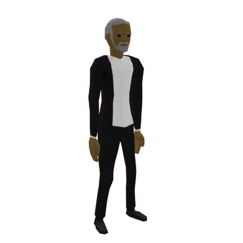            |
| Citizen          | Represents the city's population and happiness.        | Supporting Character | 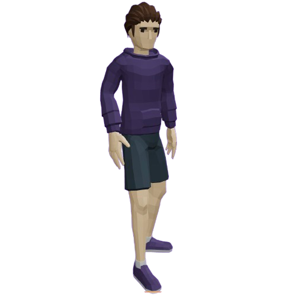          |
| Environmentalist | Provides advice and context on ecological dilemmas.    | Supporting Character | 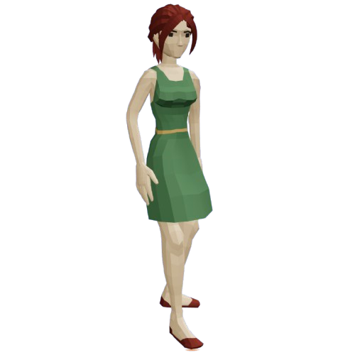 |
| Worker           | Represents the city's labor force.                     | Supporting Character | 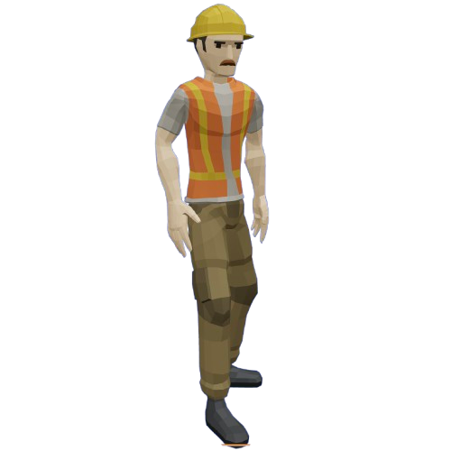           |

### 2.3.4 - Game Level

The game will feature a single-player gameplay in a sandbox mode. Players can manage their city at their own pace, with no time constraints. There is no real end to the game, except for the Game Over condition.

### 2.3.5 - Construction Grid

The game will feature a grid-based construction system, allowing players to place buildings and structures on a city map. The grid system ensures that buildings are placed in an orderly fashion and align with the city's infrastructure.

The grid system will have the following features: <!--  -->

# 3. - Assets and Resources

## 3.1 - Game Assets

The game will feature the following assets:
- **Buildings**: Residential, commercial, industrial, and public buildings.
- **Green Spaces and Energy Sources**: Parks, solar panels, wind turbines.
- **Decorative Elements**: Trees, benches, streetlights, and signs.
- **Ground Textures**: Roads, grass, water, and concrete.
- **Vehicles**: Cars, buses, bicycles, and trucks.
- **Characters**: Mayor, citizens, environmentalists, and workers.
- **Icons**: Resource indicators and game controls.
- **UI Elements**: Menus, buttons, and overlays.
- **Sound Effects**: Clicks, notifications, and environmental sounds.
- **Music**: Background tracks and ambient sounds.  
- **Fonts**: UI text fonts and styles.

The assets will be sourced from open-source libraries and created by the development team. All assets will be optimized for performance and visual consistency.

### 3.1.1 - Buildings

The game will feature the following building types:

1. **Residential Buildings**: Houses and apartments for citizens.
2. **Commercial Buildings**: Shops, restaurants, and businesses.
3. **Industrial Buildings**: Factories and warehouses.
4. **Public Buildings**: Schools, hospitals, and government offices.

#### 3.1.1.1 - Residential Buildings

The residential buildings are used to house the city's population. They come in various sizes and capacities, each **affecting the city's population levels.**

| Name         | Description                                                           | Price to build                                                          | Number of Citizen | Price per Citizen | Slot Needed to Built | Image                                                                                |
| ------------ | --------------------------------------------------------------------- | ----------------------------------------------------------------------- | ----------------- | ----------------- | -------------------- | ------------------------------------------------------------------------------------ |
| Small House  | A small, single-family home for 2 citizens.                           | 28 000                                                                  | 2                 | 14 000            | 1 (1x1)              | 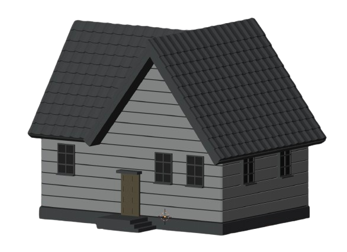  |
| Medium House | A medium-sized home for 4 citizens.                                   | 60 000                                                                  | 4                 | 15 000            | 2 (2x1)              | 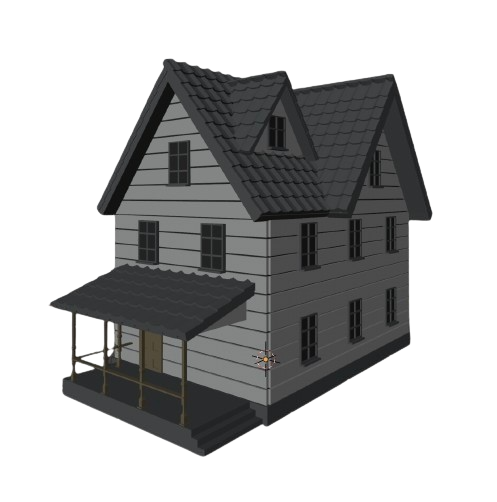 |
| Large House  | A large, multi-story home for 6 citizens.                             | 84 000                                                                  | 6                 | 14 000            | 4 (2x2)              | 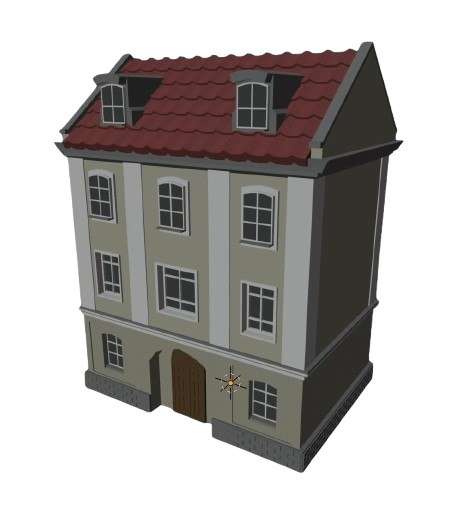  |
| Apartment    | A multi-unit building with 6 apartments. Each unit houses 4 citizens. | 1 320 000                                                               | 24                | 55 000            | 25 (5x5)             | 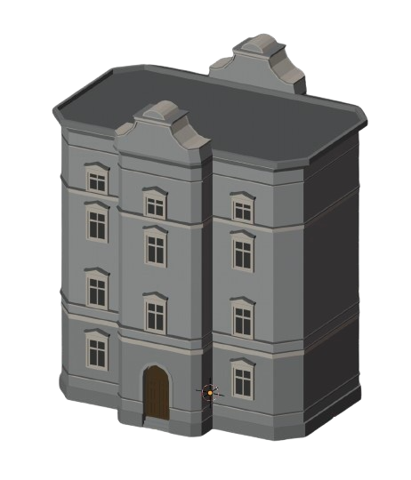    |
| Skyscraper   | A high-rise building with 32 units. Each unit houses 4 citizens.      | 7 040 000                                                               | 128               | 55 000            | 81 (9x9)             | 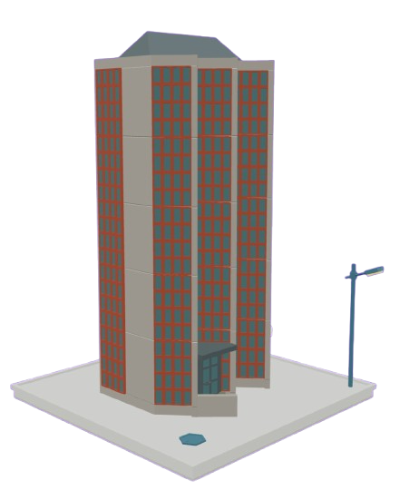   |
<!--         | Condominium                                                           | A luxury apartment building with 14 units. Each unit houses 4 citizens. | 3 360 000         | 56                | 60 000               | 56 (14x4)                                                                            |  | --> 

#### 3.1.1.2 - Commercial Buildings

The commercial buildings are used to provide goods and services to the city's population. **They generate income for the city.**

| Name          | Description                                          | Price to build | Earning by Day | Day to Earn Back | Slot Needed to Built | Image                                                                                |
| ------------- | ---------------------------------------------------- | -------------- | -------------- | ---------------- | -------------------- | ------------------------------------------------------------------------------------ |
| Bookshop      | A small shop selling books and magazines.            | -40 000        | +800           | 50               | 4 (2x2)              | 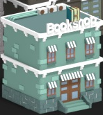      |
| BarberShop    | A barbershop offering haircuts and shaves.           | -60 000        | +1 200         | 50               | 4 (2x2)              | 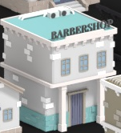    |
| Bakery        | A bakery selling bread, pastries, and cakes.         | -80 000        | +1 400         | 57               | 4 (2x2)              | 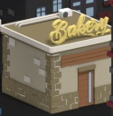        |
| Pharmacy      | A pharmacy selling medicine and health products.     | -120 000       | +2 000         | 60               | 4 (2x2)              | 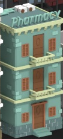      |
| Hardware Shop | A hardware store selling tools and supplies.         | -200 000       | +3 000         | 67               | 4 (2x2)              |  |
| Farm          | A farm producing fresh fruits and vegetables.        | -1 200 000     | +12 000        | 100              | 120 (12x10)          | 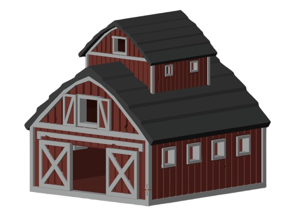          |
| Casino        | A casino offering games of chance and entertainment. | -3 000 000     | +30 000        | 100              | 12 (6x2)             | 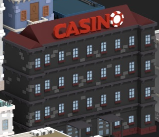        |

#### 3.1.1.2 - Industrial Buildings

The industrial buildings are used to produce goods and materials for the city. **They generate CO₂ emissions.**

| Name        | Description                              | Price to build                           | Earning by Day | Day to Earn Back | CO2 Produced by Day | Slot Needed to Built | Image                                                                              |
| ----------- | ---------------------------------------- | ---------------------------------------- | -------------- | ---------------- | ------------------- | -------------------- | ---------------------------------------------------------------------------------- |
| Factory     | A factory producing goods and materials. | -400 000                                 | +8 000         | 50               | +12 000             | 12 (4x3)             | 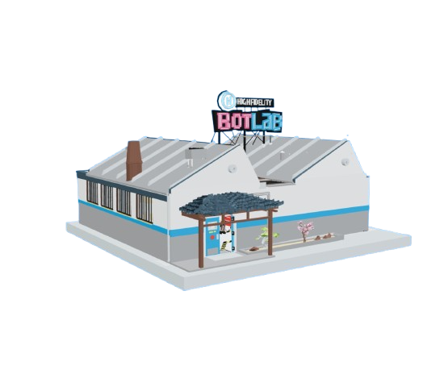     |
| Power Plant | A power plant generating electricity.    | -3 000 000                               | +45 000        | 67               | +40 000             | 25 (5x5)             | 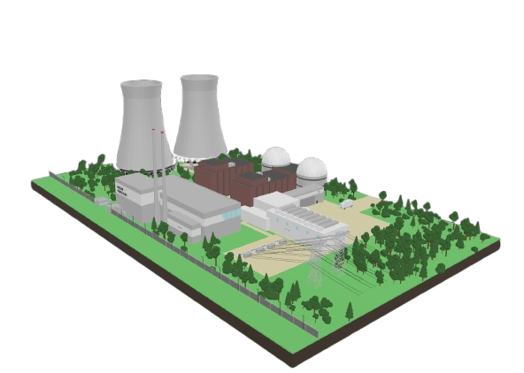 |
<!--        | Warehouse                                | A warehouse storing goods and materials. | -200 000       | +4 000           | 50                  | +1000                | 9 (3x3)                                                                            |  | --> 

#### 3.1.1.3 - Public Buildings

The public buildings are used to provide services and amenities to the city's population. **They increase citizen happiness.**

| Name      | Description                               | Price to build                        | Earning by Day | Day to Earn Back | Hapinness | Slot Needed to Built | Image                                                                        |
| --------- | ----------------------------------------- | ------------------------------------- | -------------- | ---------------- | --------- | -------------------- | ---------------------------------------------------------------------------- |
| City Hall | The city's administrative center.         | 0                                     | 0              | 0                | +100      | 6 (3x2)              | 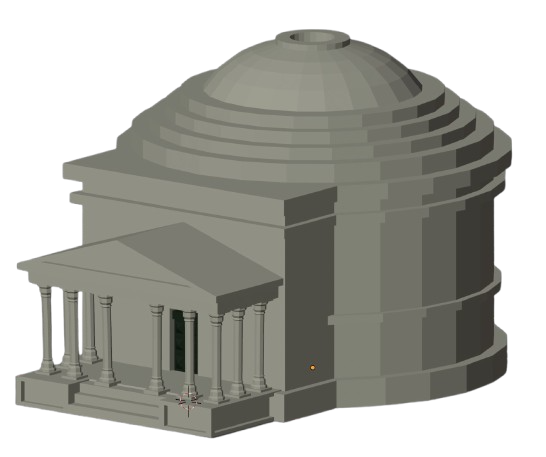 |
| School    | A school providing education to children. | -200 000                              | +1 000         | 200              | +400      | 9 (3x3)              | 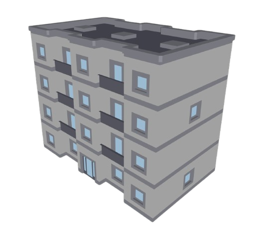    |
| Hospital  | A hospital providing medical care.        | -400 000                              | +2 000         | 200              | +600      | 9 (3x3)              | 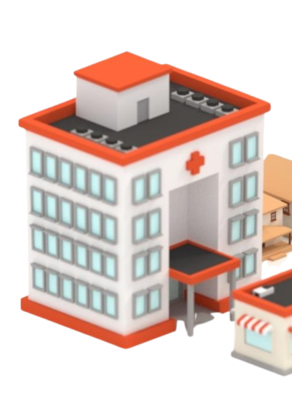  |
| Museum    | A museum showcasing art and history.      | -800 000                              | +4 000         | 200              | +1 200    | 32 (8x4)             | 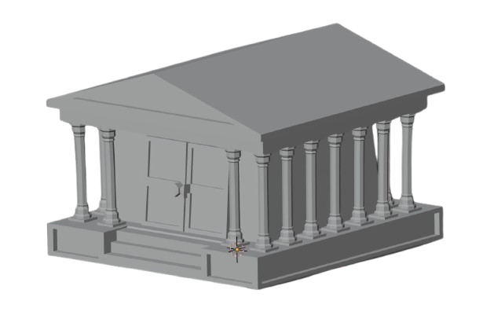    |
<!--      | Temple                                    | A temple offering spiritual services. | -1 200 000     | +6 000           | 200       | +1 400               | 9 (3x3)                                                                      |  | --> 

### 3.1.2 - Green Spaces and Energy Sources

The Green Spaces and Energy Sources are used to reduce CO₂ emissions and increase citizen happiness. **They provide environmental benefits, financial income and increase citizen satisfaction.**

The game will feature the following green spaces and energy sources:

1. **Parks**: Increase happiness and reduce CO₂ emissions.
2. **Lakes**: Increase happiness and reduce CO₂ emissions.
3. **Wind Turbines**: Generate income and reduce CO₂ emissions.
4. **Solar Panels**: Generate income and reduce CO₂ emissions.

| Name         | Description                                 | Price to build | Earning by Day | Day to Earn Back | CO2 Non-Produced by Day | Happiness | Slot Needed to Built | Image                                                                                 |
| ------------ | ------------------------------------------- | -------------- | -------------- | ---------------- | ----------------------- | --------- | -------------------- | ------------------------------------------------------------------------------------- |
| Park         | A public park with green spaces and trees.  | -40 000        | +100           | 400              | -600                    | +300      | 4 (2x2)              |                                                                                       |
| Lake         | A natural lake providing water and scenery. | -80 000        | +200           | 400              | -800                    | +400      | 9 (3x3)              | 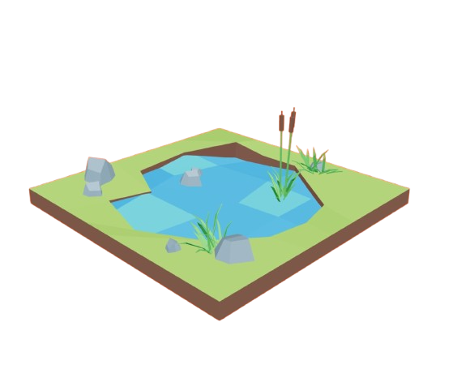         |
| Wind Turbine | Wind turbines generating electricity.       | -360 000       | +2 000         | 180              | -1 200                  | 0         | 12 (4x3)             | 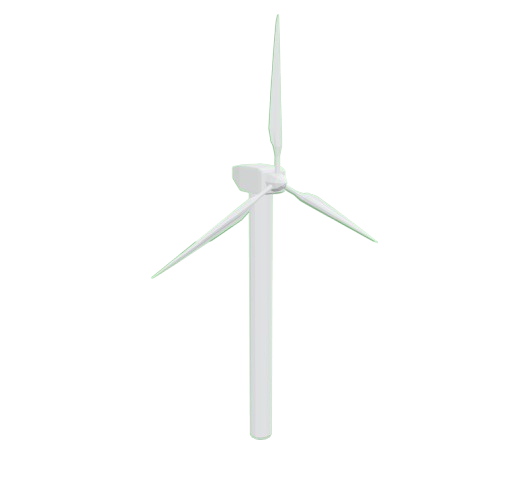 |
| Solar Panel  | Solar panels generating electricity.        | -600 000       | +4 000         | 150              | -2 000                  | 0         | 16 (4x4)             | 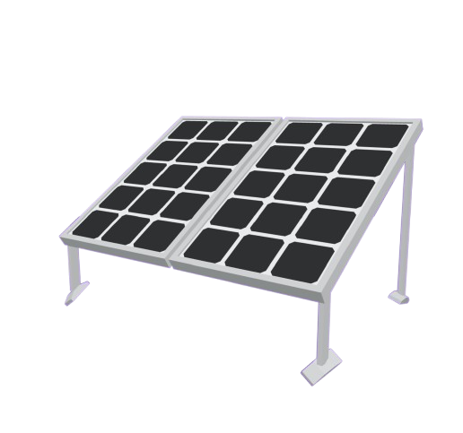  |

### 3.1.3 - Decorative Elements

The decorative elements are used to enhance the city's aesthetics and increase citizen happiness. **They provide environmental benefits and increase citizen satisfaction.**

The game will feature the following decorative elements:

| Name        | Description                            | Price to build | Earning by Day | Day to Earn Back | CO2 Non-Produced by Day | Happiness | Slot Needed to Built | Image                                                                    |
| ----------- | -------------------------------------- | -------------- | -------------- | ---------------- | ----------------------- | --------- | -------------------- | ------------------------------------------------------------------------ |
| Trees       | A spot of several trees.               | -1 000         | 0              | Never            | -50                     | +10       | 1 (1x1)              | 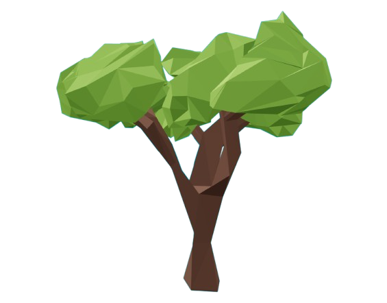       |
| Bench       | A bench for citizens to sit and relax. | -1 000         | 0              | Never            | 0                       | +20       | 1 (1x1)              | 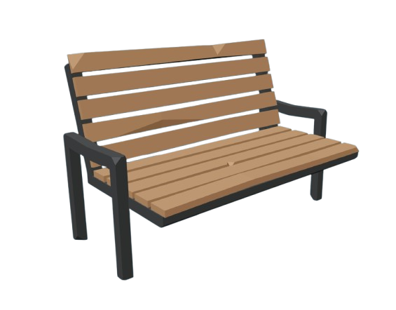       |
| Streetlight | A streetlight to illuminate the city.  | -1 000         | 0              | Never            | 0                       | +10       | 1 (1x1)              | 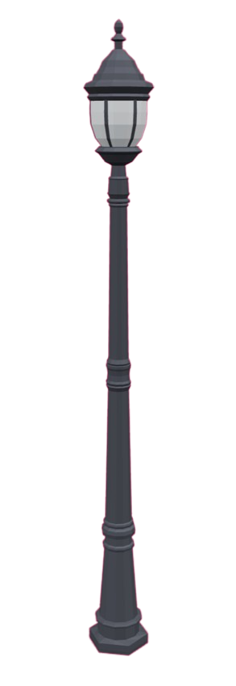 |

### 3.1.4 - Ground Textures

Following are the ground textures that will be used in the game:

| Name     | Description                           | Image                                                               |
| -------- | ------------------------------------- | ------------------------------------------------------------------- |
| Road     | A paved road for vehicles.            | 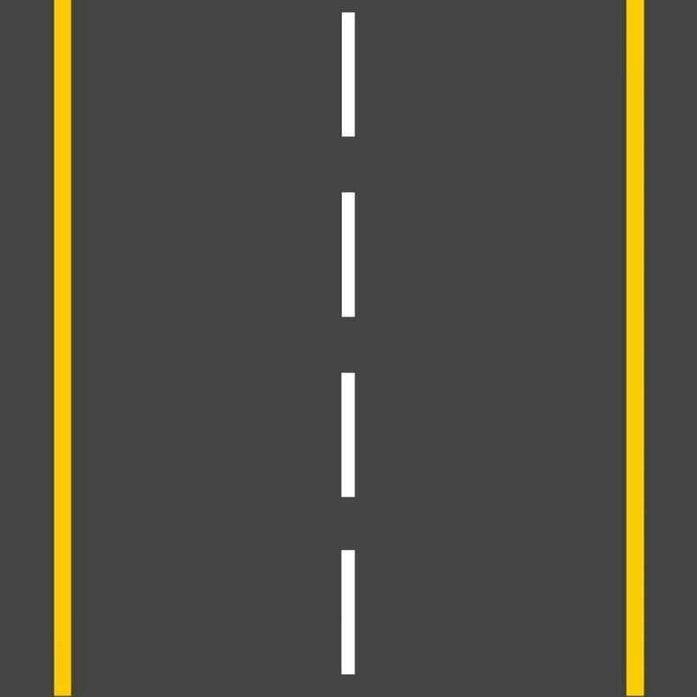     |
| Grass    | A grassy area for parks and lawns.    | 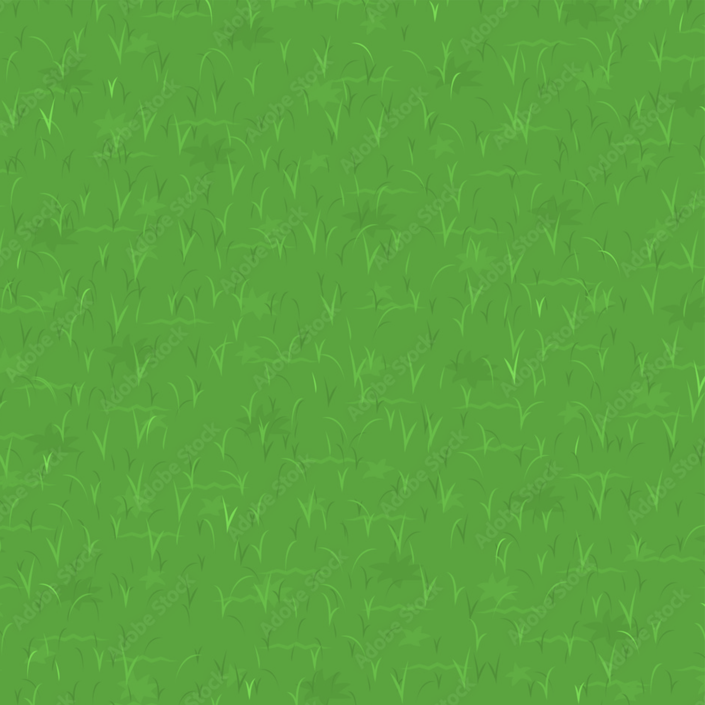    |
| Water    | A water texture for lakes and rivers. |     |
| Concrete | A concrete texture for buildings.     | 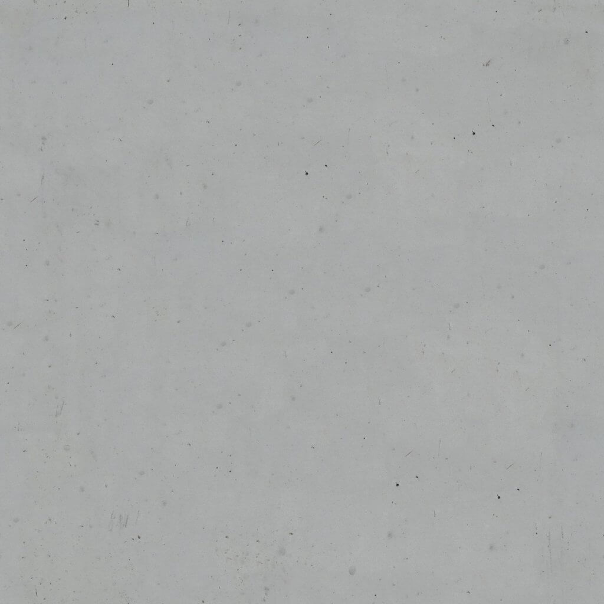 |

### 3.1.5 - Vehicles

The game will feature the following vehicles:

| Name      | Description                           | Image                                                                |
| --------- | ------------------------------------- | -------------------------------------------------------------------- |
| Car       | A car for citizens to travel.         |        |
| Bicycle   | A bicycle for citizens to ride.       | 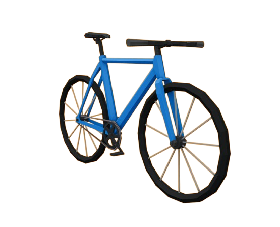   |
| Police    | A police car for law enforcement.     | 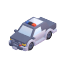    |
| Ambulance | An ambulance for medical emergencies. | 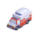 |
| Firetruck      | A fire truck for firefighting.        | 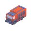      |
| Garbage truck     | A garbage truck for waste collection. | 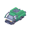 |

### 3.1.6 - Icons

Icons are used to represent resources, controls, and information in the game. The game will feature the following icons:

| Name       | Description                              | Image                                                                 |
| ---------- | ---------------------------------------- | --------------------------------------------------------------------- |
| CO2        | Icon representing CO2 emissions.         | 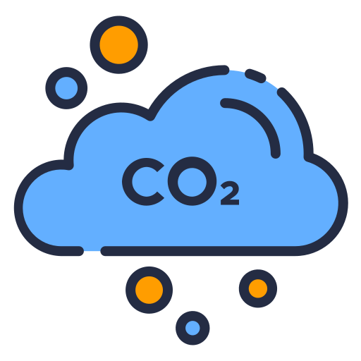        |
| Money      | Icon representing financial resources.   |       |
| Population | Icon representing the city's population. | 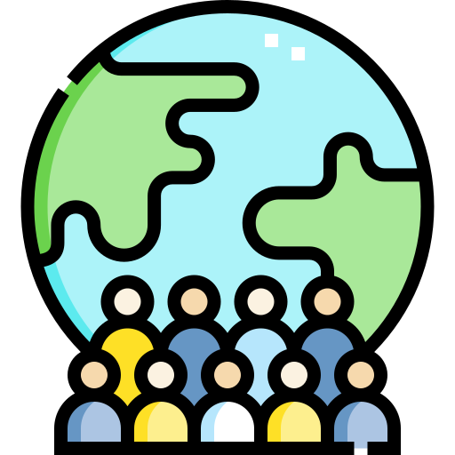 |
| Happiness  | Icon representing citizen satisfaction.  |   |
| Clock      | Icon representing the time.              | 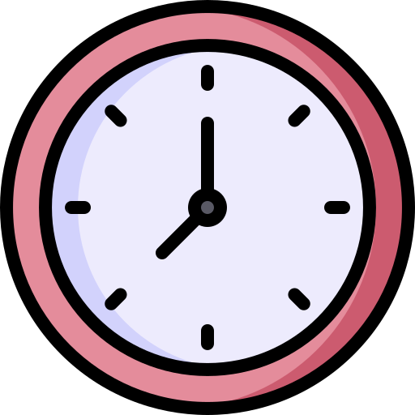      |

### 3.1.7 - Sound Effects

The list of the sound effect is not defined at the moment, All the sound effects will be downloaded from the [Universal-Soundbank](https://www.universal-soundbank.com/).

### 3.1.8 - Music

Background music is used to set the tone and atmosphere of the game. The game will feature 1 background track that will loop during gameplay.
The track is not copyrighted, you can find it here: [🔗 Background Music](https://youtu.be/tsoRvdnl1fk?si=l55ZUXQx6pxbNFJU)

### 3.1.9 - Fonts

Fonts are used to display text and information in the game. The game will feature a main font for the headings and a secondary font for the body text.

#### 3.1.9.1 - Main Font

The main font used in the game is **Parkinsans**. It is a clean, modern font that is easy to read and suitable for UI elements and text.

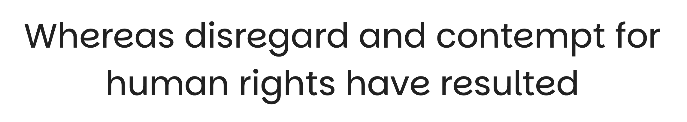

🔗 The font can be downloaded [here](https://fonts.google.com/specimen/Parkinsans)

#### 3.1.9.2 - Secondary Font

The secondary font used in the game is **Roboto**. It is a versatile, easy-to-read font that is suitable for body text and subtitles.

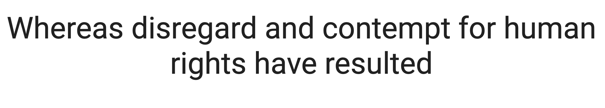

🔗 The font can be downloaded [here](https://fonts.google.com/specimen/Roboto)
