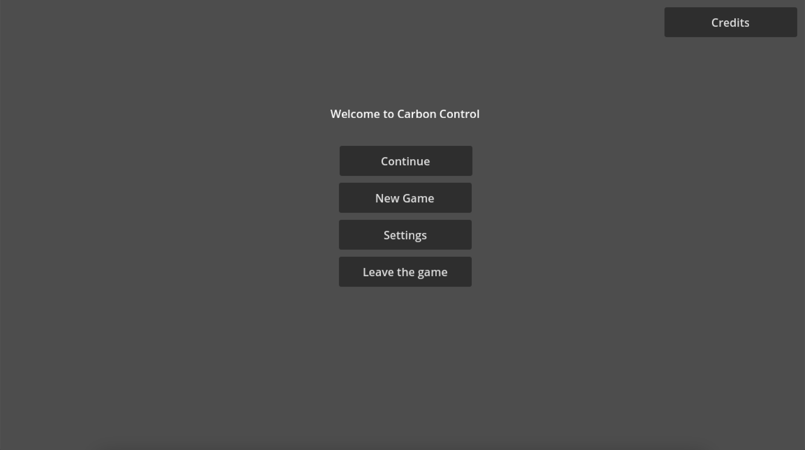

# User Manual for Carbon Control

## Table of Contents

- [Introduction](#introduction)
- [Quick Start](#quick-start)
- [User Interface](#user-interface)
- [Game Mechanics](#game-mechanics)
- [Buildings and Infrastructure](#buildings-and-infrastructure)
- [Environmental Management](#environmental-management)
- [Events and Challenges](#events-and-challenges)
- [Tips and Strategies](#tips-and-strategies)
- [Troubleshooting and FAQ](#troubleshooting-and-faq)
- [Credits and Acknowledgements](#credits-and-acknowledgements)

## Introduction

Welcome to the user manual for **Carbon Control**, a city management game focused on climate change. In Carbon Control, you are in charge of a growing city, tasked with developing it while keeping carbon dioxide (CO2) emissions under control.

### Concept and Objective of the Game

Carbon Control challenges you to manage a city for 10 years while keeping CO2 emissions below 200 million tonnes. Every decision you make will impact both the environment and the development of your city. Your goal is to find the perfect balance between economic growth and environmental sustainability.

### Installation and System Requirements

Carbon Control is developed using the Godot game engine. To play Carbon Control, your system must meet the following minimum requirements:

- **Operating System**: Windows 10/11, macOS 10.12+, or Linux
- **Processor**: Intel Core i3 or equivalent
- **Memory**: 4 GB RAM
- **Graphics Card**: Compatible with OpenGL 3.3
- **Disk Space**: 500 MB of free space

To install the game:

1. Download the installation file from the official Carbon Control website.
2. Run the installation file and follow the on-screen instructions.
3. Once installation is complete, launch the game from the shortcut created on your desktop or in the Start menu.

## Quick Start

Welcome to Carbon Control! This Quick Start guide will help you set up your game and get started with managing your city effectively.

### 1. Starting a New Game

To begin your journey in Carbon Control, follow these steps:

- Launch the game from your desktop or Start menu.

- From the main menu, select New Game.

### 2. Basic Controls

Familiarizing yourself with the controls is crucial for effective city management. Here are the default controls:

- W/A/S/D: Move the camera around the city.
- Mouse Scroll Wheel: Zoom in and out.
- Left Mouse Button: Select buildings and interact with menus.
- Right Mouse Button: Rotate the camera view.
- Esc: Open the main menu or pause the game.

If you wish to customize your controls, you can do so from the main menu:

- Navigate to the Settings page.
- Select Controls to view and edit the key bindings according to your preferences.

Customizing your controls can enhance your gameplay experience, making it easier to manage your city effectively!

### 3. First Steps

Once you've entered your city, it's time to take action:

Familiarize yourself with the HUD:

- Top left: Resource information including Money, CO2 Emissions, Citizens Number, and Happiness Percent.
- Top right: Current date (remember, you have a maximum of 10 years to reach your goal).
- Bottom right: Building buttons for constructing your city.

Build Basic Infrastructure:

- Click on the building buttons in the bottom right corner.
- Select and place essential buildings such as residential zones, power plants, and roads.

Manage Resources:

- Keep an eye on your resource levels displayed in the top left corner.
- Balance your budget, monitor population growth, and maintain citizen happiness.

Monitor CO2 Emissions:

- Regularly check your CO2 emissions indicator in the top left.
- Your primary goal is to keep emissions below 200 million tonnes over the 10-year period.

Plan for the Long Term:

- Remember that you have 10 years (as shown in the top right) to achieve your objectives.
- Each decision you make should consider both immediate needs and long-term sustainability.

By following these steps and utilizing the information provided on your HUD, you'll be well-equipped to start building and managing your sustainable city in Carbon Control.

## User Interface

The User Interface (UI) in Carbon Control is designed to provide you with all the necessary information and controls to manage your city effectively. Below are the key components of the UI:

### 1. Main Game Screen

**Top Left: Resource Panel**

- Displays crucial information about your city's resources, including Money, CO2 Emissions, Citizens, and Happiness.

**Top Right: Date and Time**

- Shows the current in-game date, reminding you of your 10-year objective.

**Bottom Right: Building Menu**

- Access various building options to develop your city.

**Centre: City View**

- The main area where you can view and interact with your city.

### 2. Building Menu

**Categories**: Buildings are organized into categories such as Residential, Commercial, Industrial, and Infrastructure.

**Selection**: Click on a building type to select it, then click on the city view to place it.

**Information**: Hover over buildings to see their cost, benefits, and environmental impact.

### 3. Environmental Impact Dashboard

**CO2 Emissions Graph**: Track emissions over time.

**Pollution Levels**: Monitor air, water, and soil quality indicators.

**Green Initiatives**: Overview of eco-friendly projects and their impact.

### 4. Policy Implementation Screen

**Available Policies**: List of policies you can implement.

**Active Policies**: Currently enforced policies and their effects.

**Policy Costs**: Financial and social impacts of each policy.

### 5. Research and Technology Tree

**Research Points**: Track your progress towards new technologies.

**Technology Categories**: Group advancements by sector (e.g., Energy, Transportation, Industry).

**Unlock Requirements**: View prerequisites for each technology.

By understanding these UI elements, you'll be better equipped to make informed decisions and effectively manage your city's growth while balancing environmental concerns.

## Game Mechanics

The **Game Mechanics** section focuses on the core principles of gameplay, detailing how to strategically manage resources, tackle environmental challenges, and develop your city effectively.

### Resource Management

**1. Financial Resources**:
- Revenue is generated through taxes, industry profits, and trade.
- Expenses include building maintenance, policies, and disaster recovery.
- Aim to maintain a balanced budget to avoid bankruptcy.

**2. Citizen Happiness**:
- Citizen satisfaction is influenced by employment rates, housing, and pollution levels.
- Higher happiness attracts more citizens and increases productivity.

**3. CO2 Emissions**:
- Activities such as industrial expansion and fossil fuel power generation increase emissions.
- Use renewable energy sources and implement policies to reduce emissions.

### Decision-Making and Strategy

Every action has a consequence. Plan your city’s development by considering short-term benefits versus long-term sustainability:
- Prioritize energy-efficient buildings.
- Allocate land for green spaces to counteract pollution.
- Implement eco-friendly policies that benefit both citizens and the environment.

### Random Events

Throughout the game, random events will occur, such as:
- Natural disasters like floods or droughts.
- Economic booms or recessions.
- Environmental breakthroughs.

Each event presents an opportunity or challenge, requiring you to adapt your strategy dynamically.

## Buildings and Infrastructure

In this section, we delve into the various buildings and infrastructure that form the backbone of your city in Carbon Control.

### Types of Buildings

**1. Residential Zones**:
- Provide housing for citizens.
- Higher-density zones accommodate more citizens but may increase pollution.

**2. Commercial Zones**:
- Generate revenue through businesses.
- Improve employment rates and citizen happiness.

**3. Industrial Zones**:
- Boost city income but are a major source of CO2 emissions.
- Transition to green industries to mitigate environmental impact.

**4. Utilities and Services**:
- Power Plants: Choose between fossil fuels and renewable energy sources.
- Waste Management: Build recycling centers and landfills to manage waste effectively.
- Water Facilities: Ensure access to clean water for citizens.

### Transportation Infrastructure

**1. Roads and Highways**:
- Connect various parts of the city to facilitate movement.
- Increased traffic can lead to higher emissions.

**2. Public Transit**:
- Build subways, buses, and trams to reduce traffic congestion and emissions.
- Encourage citizens to use public transit through policies and incentives.

### Special Buildings

**1. Landmarks**:
- Improve citizen happiness and attract tourism.
- Some landmarks have unique effects on your city.

**2. Research Labs**:
- Unlock advanced technologies and eco-friendly solutions.

**3. Parks and Green Spaces**:
- Enhance air quality and improve citizen happiness.

### Construction and Maintenance

Building and maintaining infrastructure require careful planning and resource allocation:
- Costs: Monitor upfront construction costs and ongoing maintenance expenses.
- Upgrades: Invest in building upgrades to improve efficiency and reduce emissions.
- Durability: Some buildings degrade over time and need repairs or replacement.

By effectively managing your buildings and infrastructure, you can create a thriving, sustainable city that balances economic growth and environmental preservation.

## Environmental Management

Environmental management is at the heart of **Carbon Control**, requiring careful balancing of city development and ecological sustainability. This section will help you navigate the tools and strategies available for maintaining a healthy environment in your city.

### CO2 Emissions Control

**1. Tracking Emissions**:
- The CO2 indicator on the HUD provides real-time data on your city's emissions.
- Utilize the CO2 Emissions Graph to monitor trends and identify problem areas.

**2. Reducing Emissions**:
- Transition to renewable energy sources like wind, solar, and hydro.
- Upgrade industrial buildings with eco-friendly technologies.
- Implement policies that incentivize low-emission practices among businesses.

**3. Enhancing Carbon Sequestration**:
- Plant trees and create urban forests to absorb CO2.
- Develop wetlands and other natural landscapes to capture carbon naturally.

### Pollution Management

**1. Air Quality**:
- Monitor air pollution through the Environmental Impact Dashboard.
- Reduce pollution by promoting cleaner transportation and industries.

**2. Water Quality**:
- Prevent industrial runoff by enforcing strict water management regulations.
- Build advanced water treatment facilities.

**3. Soil Health**:
- Implement policies to reduce agricultural chemicals.
- Promote sustainable farming practices and composting.

By actively managing emissions and pollution, you can foster a healthier environment and increase the quality of life for your citizens.

## Events and Challenges

Events and challenges in **Carbon Control** are designed to test your decision-making skills and adaptability. These occur periodically and can have both positive and negative impacts on your city.

### Random Events

Random events add unpredictability to the game. Examples include:

- **Economic Boom**: Increases revenue generation temporarily.
- **Natural Disasters**: Floods or droughts may damage infrastructure and reduce citizen happiness.
- **Technological Breakthroughs**: Unlocks advanced buildings or policies earlier.

### Dilemmas

Dilemmas force you to choose between competing priorities:

- **Rebuild vs. Renovate**: Rebuilding is expensive but reduces emissions long-term, while renovating is cheaper but less effective.
- **Public Transport vs. Cars**: Investing in public transport lowers CO₂ emissions but has a higher initial cost.

### Long-Term Challenges

These challenges evolve with your city:

- **Population Growth**: Managing increasing resource demands without exceeding CO₂ limits.
- **Climate Crises**: Adapting to harsher environmental conditions as the game progresses.

By carefully planning and responding to these challenges, you can maintain the balance required to win.

---

## Tips and Strategies

### Resource Management

- **Monitor CO₂ Levels**: Keep emissions in check by prioritizing green energy and eco-friendly policies.
- **Balance Budget**: Avoid overspending on unnecessary upgrades early in the game.
- **Citizen Happiness**: Invest in amenities and green spaces to keep your population satisfied.

### Long-Term Planning

- **Focus on Renewable Energy**: Gradually phase out fossil fuels to reduce emissions and increase sustainability.
- **Upgrade Infrastructure**: Upgrade buildings to improve efficiency and reduce maintenance costs.
- **Plan City Layout**: Group residential zones away from industrial areas to minimize pollution effects.

### Policies and Research

- **Enact Green Policies**: Subsidies for public transport or tax incentives for clean industries can have significant benefits.
- **Prioritize Research**: Unlock technologies that boost efficiency or reduce environmental impact.

### Responding to Crises

- **Build Resilience**: Have a financial cushion to recover quickly from natural disasters.
- **Adapt Strategies**: Be ready to pivot plans based on unexpected events or challenges.

---

## Troubleshooting and FAQ

### Common Issues

**Q: The game is running slowly. What should I do?**

- Ensure your system meets the minimum requirements.
- Reduce graphics settings in the **Settings** menu.
- Close background applications to free up system resources.

**Q: I can’t select buildings or interact with the menu.**

- Check if the game is paused.
- Ensure your mouse or input device is functioning correctly.
- Restart the game if the issue persists.

**Q: My CO₂ levels are too high, and I’m about to lose. What can I do?**

- Quickly switch to renewable energy sources.
- Invest in green spaces to offset emissions.
- Enact emergency eco-friendly policies to stabilize levels.

### Technical Support

For further assistance, visit the official support page or contact the **Carbon Control** development team at support@carboncontrol.com.

---

## Credits and Acknowledgements

**Carbon Control** was developed by Team 5 using the Godot Engine. Special thanks to all contributors and stakeholders for their hard work and dedication.

### Development Team

- **Project Manager**: Rémy Charles
- **Program Manager**: Pierre Gorin
- **Technical Lead**: Salaheddine Namir
- **Software Engineers**: Alexis Lasselin, Camille Gayat
- **Technical Writer**: Elone Delille
- **Quality Assurance**: Maxime Caron

### Acknowledgements

We would like to thank the following:

- **Godot Engine Community**: For providing an excellent open-source platform.
- **Educational Institutions**: For inspiring the development of a serious game with real-world applications.
- **Playtesters**: For their valuable feedback during development.